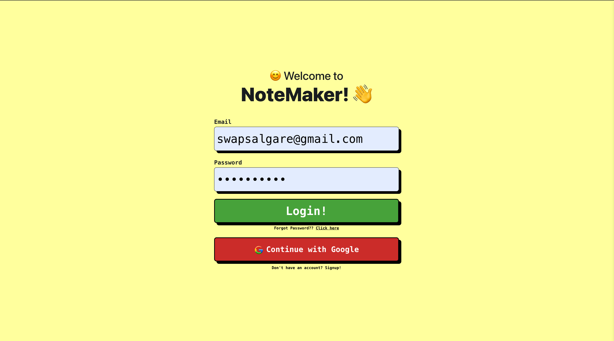
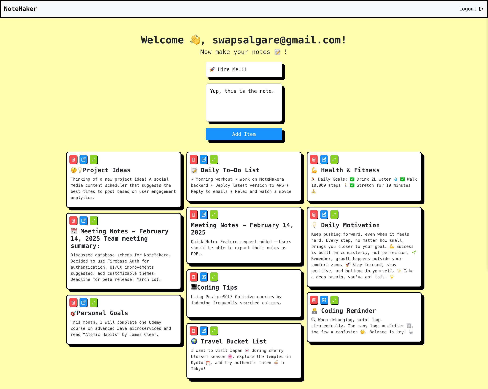
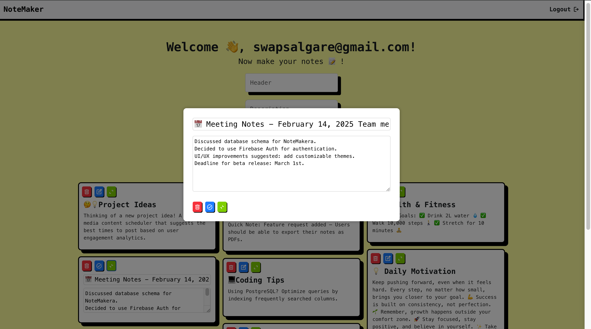
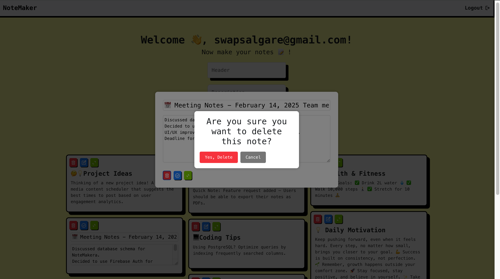

# Student Records App
# NoteMaker

NoteMaker is a simple and efficient note-taking application that allows users to create, update, retrieve, and delete notes. It features a user-friendly React frontend and a robust Java Spring Boot backend with MongoDB for data storage.

## 📌 Features
- 📝 Create, edit, and delete notes
- 🔍 Fetch all notes or filter by user
- 🚀 Fast and responsive UI using React.js
- ⚡ RESTful API with Spring Boot
- 💾 Data storage with MongoDB

---

## 🛠️ Tech Stack

### Frontend
- React.js
- Tailwind CSS (for styling)
- Axios (for API requests)

### Backend
- Java Spring Boot
- Spring Data MongoDB
- RESTful API

### Database
- MongoDB

---

## 📂 Project Structure

### Frontend (React.js)
```
NoteMaker-frontend/
│-- src/
│   │-- components/
│   │-- pages/
│   │-- App.js
│   │-- index.js
│-- package.json
│-- README.md
```

### Backend (Spring Boot)
```
NoteMaker-backend/
│-- src/
│   │-- main/java/com/example/student_records/
│   │   │-- controller/ItemController.java
│   │   │-- model/Item.java
│   │   │-- repository/ItemRepository.java
│-- pom.xml
│-- application.properties
```

---

## 🚀 Setup Instructions

### Backend Setup
1. Clone the repository:
   ```bash
   git clone https://github.com/your-repo/NoteMaker-backend.git
   cd NoteMaker-backend
   ```
2. Configure MongoDB connection in `application.properties`:
   ```properties
   spring.data.mongodb.uri=mongodb://localhost:27017/NoteMaker
   ```
3. Run the application:
   ```bash
   mvn spring-boot:run
   ```

### Frontend Setup
1. Clone the repository:
   ```bash
   git clone https://github.com/your-repo/NoteMaker-frontend.git
   cd NoteMaker-frontend
   ```
2. Install dependencies:
   ```bash
   npm install
   ```
3. Start the frontend server:
   ```bash
   npm start
   ```

---

## 📸 Screenshots

### 🪪 Login Page


### 🏠 Homepage


### ✏️ Edit/View Note Page


### 🗑️ Delete Button


---

## 📜 API Endpoints

### 🔹 Item Controller (`/items`)
| Method  | Endpoint               | Description                      |
|---------|------------------------|----------------------------------|
| `POST`  | `/items`               | Create a new note               |
| `PUT`   | `/items/{id}`          | Update an existing note         |
| `GET`   | `/items/`              | Get all notes                   |
| `GET`   | `/items/user/{userId}` | Get notes by user ID            |
| `DELETE`| `/items/{id}`          | Delete a note by ID             |

---

## 🎯 Future Enhancements
- 🛠️ User authentication (Firebase/Auth0)
- 📌 Note categories and tags
- 📅 Reminder and scheduling features

---

## 🤝 Contributing
Feel free to contribute by opening issues or submitting pull requests. Let's build something amazing together! 🚀

---

## 📜 License
This project is licensed under the MIT License.


